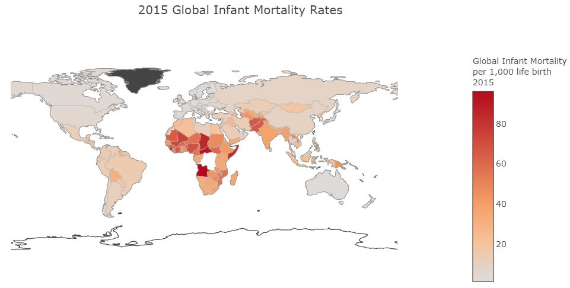
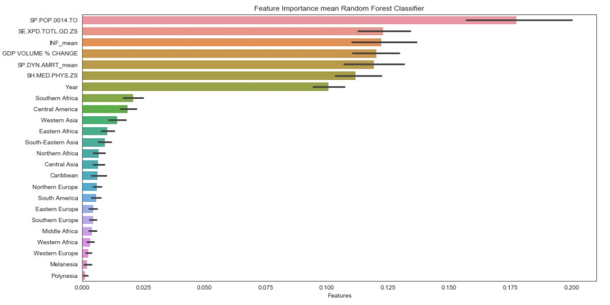

# Infant-mortality
Infant mortality rate is defined as the number of children that die before their first birthday per 1000 life birth. In their millenial goals the UN declared decreasing infant mortality among others a priority. So my questions was what are the most effective ways to decrease infant mortality in developing countries?

# Data
The dataset that originally inspired my questions can be found on [Kaggle](https://www.kaggle.com/theworldbank/health-nutrition-and-population-statistics/home). The data has been collected for 263 countries annually since 1960. The dataset has 345 features, but more can be found when visiting [the world bank](https://data.worldbank.org/) directly. The features included can be categorized into the following classes: Most of the data is population data, which includes among others infant mortality rate, but also adult mortality, and it contains details about the female and male age distribution of each country. Second most common class is infectious diseases: This includes immunization, detection, treatment success rates for life threatening infectious diseases like HIV, malaria, tuberculosis rates. We also have a health care group with variables like numbers of physicians per 1000 people. Further categories include data on education (school attendance and success rates), nutrition (malnutrition indicator, BMI data, vitamine A supplementation rates coverage). 

# Results
The most successful predictions for infant mortality increases were achieved using random forest classification, with an overall accuracy of 0.96 (Sensitivity:0.99, Specificity:0.60). The most effective countermeasures identified are: 
- stabilize or increase the GDP  
- increase public spending for education  
- reduce adult mortality rates  
- increase immunization rates

